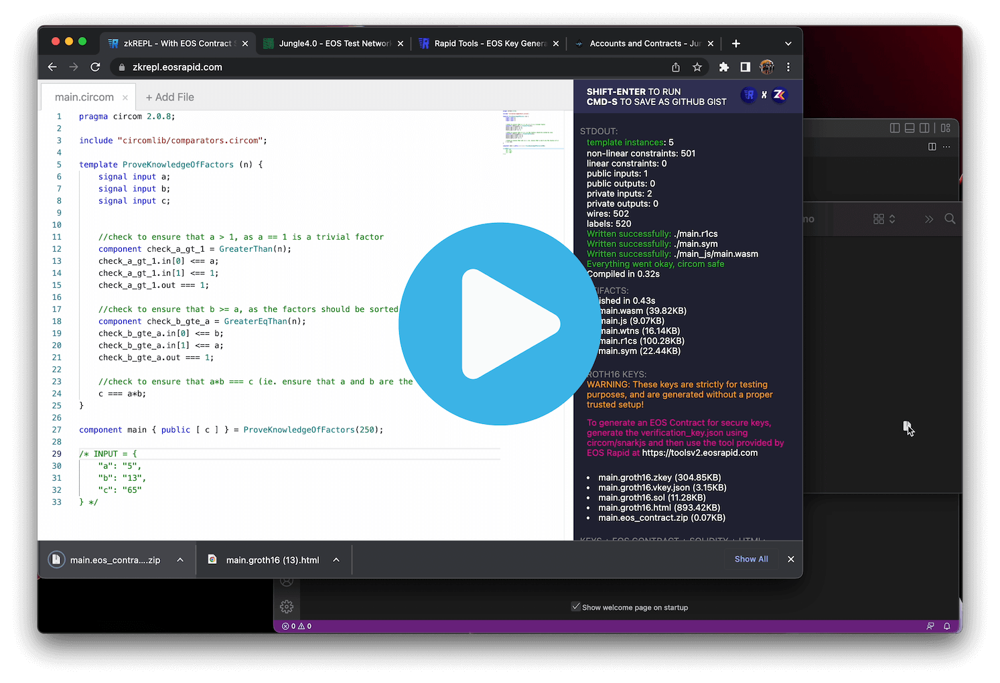

# How to deploy a zero knowledge proof enabled smart contract on EOS
## A comprehensive tutorial that demonstrates how to deploy your first zero knowledge proof enabled smart contract on EOS 🎉

## Full Tutorial Video (Zero to Zero Knowledge in less than 7 minutes!)

## Links used in the tutorial
- [EOS Enabled Circom IDE (zkRepl)](https://zkrepl.eosrapid.com)
- [EOS Rapid Tools](https://toolsv2.eosrapid.com)
- [Jungle Testnet v4 Monitor](https://monitor4.jungletestnet.io)
- [Jungle Testnet v4 Block Explorer](https://jungle.eosio.online/accounts)

